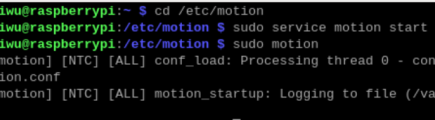
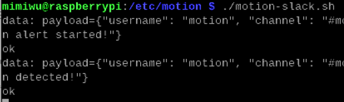
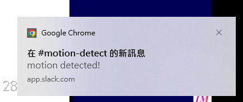
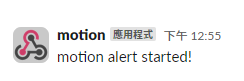
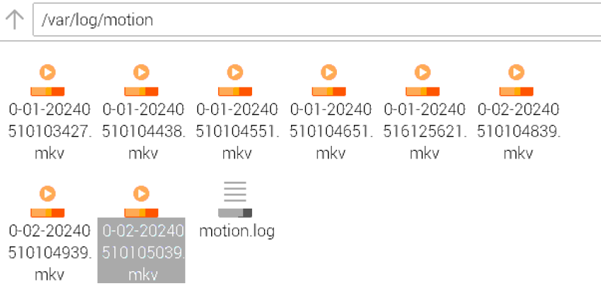

# Surveillance-camera
步驟1.幫樹莓派安裝作業系統  
  >下載樹莓派映像檔:https://www.raspberrypi.com/software/operating-systems/  (這邊用的是桌面可以用滑鼠操作的請選Raspbian Buster with desktop)  
  >把SD卡格式化為FAT32格式  
  >用balenaEtcher工具把映像檔燒到SD卡中  
  >將SD卡插入樹莓派，開機並跟著步驟完成安裝  

步驟2.利用vnc遠端桌面操作樹莓派  
  >樹莓派開機後至樹梅派左上角>偏好設定->raspberry pi 設定->介面->開啟vnc功能->右下角apply  
  >打開terminal打上"ifconfig"查看樹莓派ip位址  
  >電腦端下載vnc viewer(用哪個裝置就下載哪個os):https://www.realvnc.com/en/connect/download/viewer/windows/  
  >vnc viewer下載安裝好後打上查到的樹莓派ip位址即可遠端操作  

步驟3.安裝motion  
  >在樹莓派terminal打上"sudo apt-get install motion"(可先"sudo apt-get update、sudo apt-get upgrade")  
  >接著安裝一些必要套件"sudo apt-get install libjpeg-dev gettext libmicrohttpd-dev libavformat-dev libavcodec-dev libavutil-dev libswscale-dev libavdevice-dev libwebp-dev mysql-common libmariadb3 libpq5"(若出現錯誤就下載提供的lib檔)  
  
步驟4.調整motion設定  
  >至"/etc/motion/motion.conf"改變參數設定  
  >"sudo nano /etc/default/motion"編輯設定檔(設定檔內容看motion.conf)  
  >改好後"sudo service motion restart"  
  >"sudo service motion start" "sudo motion"  
  >"sudo service motion status"查看motion有沒有成功開啟(log及status有無錯誤訊息)  
  >motion啟動後會開始監控攝像頭並在偵測到移動時觸發事件  
  >訪問motion的網路介面:預設的motion端口號為8080(可至motion.conf更改)，在瀏覽器中輸入"樹莓派ip位址:8080"即可查看實時畫面

步驟5.使motion偵測移動時發送及時通知至slack  
  >在slack開一個新的工作區(https://slack.com/intl/zh-tw/)  
  >開啟 incoming webhook integration，會拿到一個 webhook URL，把它記下來  
  >寫一個 shell script(這邊以motion-slack.sh為檔名)，WEBHOOK_URL填入上面拿到的URL，USERNAME可以隨意更改  
  >"chmod +x motion-slack.sh"改成可執行檔  
  >
步驟6.使用tmux工具  
  >tmux是一個終端覆用工具，允許在單個終端窗口中創建多個終端會話，並在這些會話之間進行切換。使用tmux可以在終端窗口中同時運行多個命令和程序，並且可以在不同會話之間保持持久性。  
  >安裝tmux:"sudo apt install tmux"  
  >
  >在終端中運行 tmux 命令打開一個新的 tmux 會話，然後在會話中運行腳本。  
  >"tmux"   
  >"cd /etc/motion"   
  >"./motion-slack.sh"  
  >
  >停止：在 tmux會話中按下 Ctrl + D 或者執行 exit 命令來結束會話。   
  >開始使用:執行motion及tmux，查看能否在偵測移動時發送通知至slack!  

  執行成果:  
    
    
    
    
    
    
  

  
*鍵盤中文輸入設定參考:https://edumakerlab.blogspot.com/2020/03/raspberry-pi-4_13.html  
  
*slack頻道:https://app.slack.com/client/T07320789K3/C073C48FXEC  

